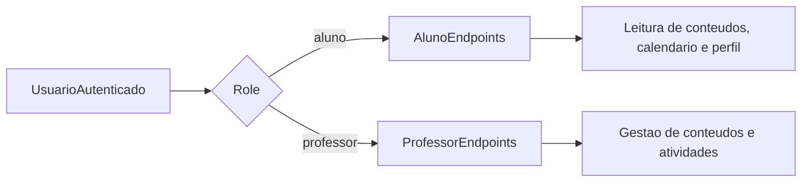

# API Discovery

## Objetivo

Traduzir o discovery funcional em capacidades iniciais de backend para a API em
`Django`, sem fixar ainda o contrato final de implementacao.

## Principios

- Uma unica API para web e mobile
- Controle de acesso por papel
- Endpoints focados em capacidades de produto
- Contratos compartilhados evoluindo em
  [packages/contracts](/Users/carlosferreira/Documents/GitHub/REMA/packages/contracts)

## Capacidades de API Por Modulo

### Auth

Capacidades:

- autenticar usuario
- retornar sessao atual
- retornar perfil e papel
- encerrar sessao

Possiveis endpoints:

- `POST /api/auth/login/`
- `GET /api/auth/me/`
- `POST /api/auth/logout/`

### Home

Capacidades:

- retornar resumo da area do aluno
- retornar resumo da area do professor

Possiveis endpoints:

- `GET /api/student/home/`
- `GET /api/teacher/home/`

### Provas / Atividades

Capacidades para aluno:

- listar atividades
- ver detalhes
- acompanhar status
- entregar resposta
- anexar arquivo quando for trabalho
- consultar nota e retorno

Capacidades para professor:

- listar atividades criadas
- criar atividade
- criar prova
- criar trabalho
- editar atividade
- publicar atividade
- acompanhar entregas
- corrigir envios
- registrar nota e comentario
- validar soma de pontuacao
- cadastrar questoes

Possiveis endpoints:

- `GET /api/activities/`
- `GET /api/activities/{id}/`
- `POST /api/activities/`
- `PATCH /api/activities/{id}/`
- `POST /api/activities/{id}/questions/`
- `PATCH /api/questions/{id}/`
- `GET /api/activities/{id}/submissions/`
- `POST /api/activities/{id}/submissions/`
- `GET /api/submissions/{id}/`
- `POST /api/submissions/{id}/confirm/`
- `POST /api/submissions/{id}/review/`

Regras conhecidas para contrato:

- `Activity.kind` deve aceitar `prova`, `atividade` e `trabalho`
- `prova` e `atividade` podem ter ate `100` questoes
- `total_score` do item deve ser `100`
- a soma de `Question.weight` deve ser `100`
- questoes podem ser `dissertativas` ou `multipla_escolha`
- questoes de multipla escolha aceitam ate `5` opcoes
- `trabalho` aceita anexo `pdf`, `doc`, `docx` ou `txt`
- o envio do aluno e unico
- em `trabalho`, o comentario do professor e obrigatorio na avaliacao

### Conteudos

Capacidades para aluno:

- listar conteudos
- ver detalhes

Capacidades para professor:

- criar conteudo
- editar conteudo
- excluir conteudo
- publicar conteudo

Possiveis endpoints:

- `GET /api/contents/`
- `GET /api/contents/{id}/`
- `POST /api/contents/`
- `PATCH /api/contents/{id}/`
- `DELETE /api/contents/{id}/`

Regras conhecidas para contrato:

- campos obrigatorios: `title`, `subtitle`, `description`, `published_at`,
  `author`
- campos opcionais: `image_url`, `video_url`

### Calendario

Capacidades:

- listar eventos
- ver detalhe
- criar evento, se permitido
- atualizar evento, se permitido
- incluir automaticamente prazos academicos
- gerenciar anotacoes pessoais do aluno

Possiveis endpoints:

- `GET /api/calendar/events/`
- `GET /api/calendar/events/{id}/`
- `POST /api/calendar/events/`
- `PATCH /api/calendar/events/{id}/`
- `GET /api/calendar/notes/`
- `POST /api/calendar/notes/`
- `PATCH /api/calendar/notes/{id}/`

### Comunidade

Capacidades:

- listar publicacoes
- criar publicacao
- comentar
- moderar posts de alunos
- consultar status de aprovacao

Possiveis endpoints:

- `GET /api/community/posts/`
- `POST /api/community/posts/`
- `GET /api/community/posts/{id}/`
- `POST /api/community/posts/{id}/comments/`
- `POST /api/community/posts/{id}/approve/`
- `POST /api/community/posts/{id}/reject/`

Regras conhecidas para contrato:

- posts de alunos aceitam `texto`, `imagem`, `video` ou `gif`
- post de aluno precisa de aprovacao de ao menos um professor
- posts de professores sao visiveis apenas para professores
- professores tambem visualizam posts dos alunos para moderacao

### Jogos

Capacidades:

- listar jogos disponiveis ao aluno
- abrir detalhe
- registrar sessao
- consultar progresso

Possiveis endpoints:

- `GET /api/games/`
- `GET /api/games/{id}/`
- `POST /api/games/{id}/sessions/`
- `GET /api/games/sessions/`

Regras conhecidas para contrato:

- escopo inicial entre `4` e `5` jogos
- pode haver integracao com biblioteca externa ou API externa

### Perfil

Capacidades:

- retornar perfil
- atualizar dados permitidos
- atualizar preferencias
- atualizar foto de perfil

Possiveis endpoints:

- `GET /api/profile/`
- `PATCH /api/profile/`
- `POST /api/profile/avatar/`

## Contratos Iniciais Recomendados

Os primeiros contratos que valem entrar em `packages/contracts` depois podem
ser:

- `AuthUser`
- `Role`
- `StudentHomeResponse`
- `TeacherHomeResponse`
- `ActivitySummary`
- `ActivityDetail`
- `QuestionDetail`
- `QuestionOption`
- `SubmissionSummary`
- `SubmissionDetail`
- `ReviewPayload`
- `ContentSummary`
- `ContentDetail`
- `CalendarEventSummary`
- `PersonalCalendarNote`
- `CommunityPostSummary`
- `CommunityModerationStatus`
- `GameSummary`
- `ProfileResponse`

## Regras de Acesso Sugeridas

## Ordem Recomendada de API

1. `auth`
2. `home`
3. `activities`
4. `contents`
5. `calendar`
6. `profile`
7. `community`
8. `games`

## Dilemas Tecnicos Que Ficam Para Depois

- sessao server-side ou token
- granularidade de permissoes
- filtros por turma, serie, disciplina ou grupo
- estrategia de paginacao
- notificacoes e eventos em tempo real
