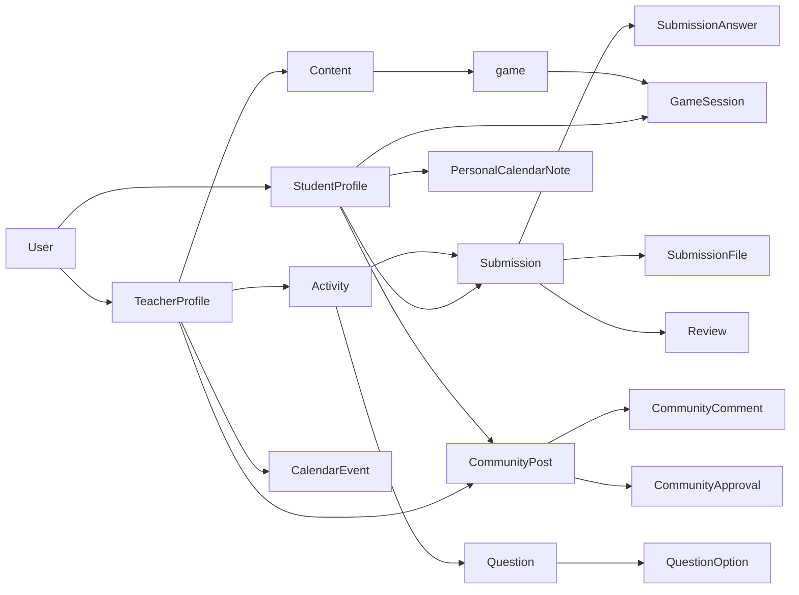

# Domain Map

## Objetivo

Levantar as entidades e relacoes de dominio necessarias para sustentar os
fluxos iniciais de aluno e professor.

## Entidades Centrais

### User

Representa a identidade autenticada no sistema.

Campos iniciais sugeridos:

- `id`
- `name`
- `email`
- `role`
- `status`
- `last_login_at`

### StudentProfile

Complementa o usuario quando o papel for aluno.

Campos iniciais sugeridos:

- `user_id`
- `display_name`
- `avatar_url`
- `preferences`

### TeacherProfile

Complementa o usuario quando o papel for professor.

Campos iniciais sugeridos:

- `user_id`
- `display_name`
- `avatar_url`
- `bio`
- `preferences`

### Content

Representa materiais pedagogicos consumidos por aluno e publicados por
professor.

Campos iniciais sugeridos:

- `id`
- `title`
- `subtitle`
- `description`
- `type`
- `status`
- `author_id`
- `published_at`
- `image_url`
- `video_url`

### Activity

Representa o item acadêmico principal do sistema.

Campos iniciais sugeridos:

- `id`
- `title`
- `description`
- `kind`
- `status`
- `due_at`
- `created_by`
- `total_score`

Observacao:

- `kind` pode assumir internamente `prova`, `atividade` ou `trabalho`
- na linguagem de produto, todos esses itens são tratados como `tarefas`

### Question

Representa cada questão de uma tarefa com questões.

Campos iniciais sugeridos:

- `id`
- `activity_id`
- `statement`
- `type`
- `weight`
- `support_image_url`
- `expected_answer`
- `position`

Observacao:

- `type` pode assumir inicialmente `dissertativa` ou `multipla_escolha`
- cada `Activity` do tipo `prova` ou `atividade` pode ter até `100` questões

### QuestionOption

Representa uma alternativa de uma questao de multipla escolha.

Campos iniciais sugeridos:

- `id`
- `question_id`
- `label`
- `position`
- `is_correct`

Observacao:

- cada questao de multipla escolha pode ter ate `5` opcoes

### Submission

Representa a resposta ou entrega do aluno a uma atividade.

Campos iniciais sugeridos:

- `id`
- `activity_id`
- `student_id`
- `status`
- `submitted_at`
- `score`
- `feedback`
- `attempt_count`

Observacao:

- o envio do aluno e unico

### SubmissionAnswer

Representa a resposta do aluno por questão em tarefas com questões.

Campos iniciais sugeridos:

- `id`
- `submission_id`
- `question_id`
- `answer_text`
- `selected_option_id`

### SubmissionFile

Representa o anexo enviado em uma tarefa com anexo.

Campos iniciais sugeridos:

- `id`
- `submission_id`
- `file_name`
- `file_url`
- `file_type`

Observacao:

- formatos esperados inicialmente: `pdf`, `doc`, `docx`, `txt`

### Review

Representa validacao e retorno do professor sobre um envio.

Campos iniciais sugeridos:

- `id`
- `submission_id`
- `reviewed_by`
- `score`
- `comment`
- `reviewed_at`

Observacao:

- em `trabalho`, o comentário do professor é obrigatório

### CalendarEvent

Representa compromissos e datas relevantes.

Campos iniciais sugeridos:

- `id`
- `title`
- `description`
- `type`
- `start_at`
- `end_at`
- `created_by`

### PersonalCalendarNote

Representa anotação individual criada pelo aluno no calendário.

Campos iniciais sugeridos:

- `id`
- `student_id`
- `title`
- `description`
- `start_at`
- `end_at`

### CommunityPost

Representa publicacoes da comunidade.

Campos iniciais sugeridos:

- `id`
- `author_id`
- `audience`
- `title`
- `body`
- `status`
- `created_at`
- `image_url`
- `video_url`
- `gif_url`

### CommunityApproval

Representa a aprovacao de um post de aluno por professor.

Campos iniciais sugeridos:

- `id`
- `post_id`
- `approved_by`
- `status`
- `comment`
- `approved_at`

### CommunityComment

Representa comentario em publicacao da comunidade.

Campos iniciais sugeridos:

- `id`
- `post_id`
- `author_id`
- `body`
- `created_at`

### Game

Representa experiencia ludica disponivel ao aluno.

Campos iniciais sugeridos:

- `id`
- `title`
- `description`
- `status`
- `content_relation`

### GameSession

Representa a participacao do aluno em um jogo.

Campos iniciais sugeridos:

- `id`
- `game_id`
- `student_id`
- `score`
- `progress`
- `played_at`

## Relacoes Iniciais

## Leitura de Dominio Por Modulo

### Login

- `User`
- `StudentProfile`
- `TeacherProfile`

### Home

- agrega `Activity`, `Content`, `CalendarEvent`, `CommunityPost` e possivelmente
  `GameSession`

### Tarefas

- `Activity`
- `Question`
- `QuestionOption`
- `Submission`
- `SubmissionAnswer`
- `SubmissionFile`
- `Review`

### Conteúdos

- `Content`

### Calendário

- `CalendarEvent`
- `PersonalCalendarNote`

### Comunidade

- `CommunityPost`
- `CommunityComment`
- `CommunityApproval`

### Jogos

- `Game`
- `GameSession`

### Perfil

- `StudentProfile`
- `TeacherProfile`

## Dilemas de Dominio Ainda Abertos

- `User` tera um unico `role` ou papeis multiplos?
- `Activity.kind` cobre `prova`, `atividade` e `trabalho` ou `trabalho` deve
  virar entidade propria no futuro?
- `CalendarEvent` e sempre criado por professor ou tambem por sistema?
- `CommunityPost.audience` sera sempre segmentado por perfil?
- `CommunityApproval` precisa registrar apenas aprovacao ou tambem rejeicao com
  motivo?
- `Game` sera autonomo ou vinculado a `Content` e `Activity`?
