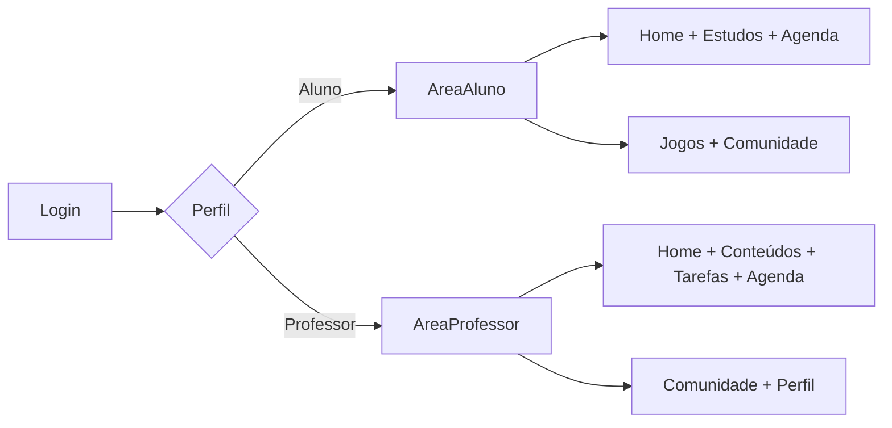

# Product Vision

## Objetivo

Documentar uma visão inicial do produto REMA a partir do fluxograma enviado,
servindo como base para refinamentos futuros de negócio, UX e API.

## Proposta Inicial

O REMA nasce como uma plataforma educacional com duas experiências principais:

- `Aluno`: consumir conteúdos, acompanhar tarefas, organizar a
  rotina, participar da comunidade e interagir com recursos lúdicos.
- `Professor`: publicar conteúdos, criar tarefas, acompanhar o calendário e
  interagir com uma comunidade profissional.

O módulo acadêmico passa a ter três objetos pedagógicos principais:

- `Tarefa com questões`: conjunto de questões avaliativas
- `Tarefa com anexo`: atividade com descrição livre e envio de arquivo pelo aluno
- Internamente, o domínio ainda mantém `prova`, `atividade` e `trabalho`

## Perfis Atendidos

- `Aluno`
- `Professor`

Ambos entram por um fluxo unico de autenticacao e sao direcionados para uma
experiencia adaptada ao seu papel.

## Problemas Que o Produto Parece Resolver

### Para Aluno

- Dificuldade para centralizar tarefas e materiais
- Falta de visibilidade da rotina academica
- Baixo engajamento em ambientes de estudo tradicionais

### Para Professor

- Dificuldade para organizar e publicar materiais em um unico ambiente
- Falta de um espaco central para acompanhar atividades e eventos
- Necessidade de troca entre pares em uma comunidade propria

## Proposta de Valor Inicial

- Centralizar rotina academica em um unico sistema
- Entregar experiencias diferentes para aluno e professor sobre a mesma base
- Combinar produtividade academica com elementos de engajamento

## Modulos Iniciais

- `Login`
- `Home`
- `Tarefas`
- `Conteúdos`
- `Calendário`
- `Comunidade`
- `Perfil`
- `Jogos` para aluno

## Regras Estruturais Ja Conhecidas

### Avaliacoes

- Tarefas com questões são conjuntos de questões
- Cada tarefa com questões pode ter até `100` questões
- A pontuação total das tarefas deve ser `100`
- Quando houver pontuação por questão, a soma das questões deve ser
  obrigatoriamente `100`
- Cada questão pode ser:
  - `dissertativa`
-  - `multipla escolha` com até `5` opções
- A questão pode conter imagem para interpretação
- A questão possui explicação esperada ou gabarito de apoio, não visível ao
  aluno no momento da realização
- O sistema precisa registrar status de envio do aluno

### Tarefas com anexo

- A tarefa com anexo é tratada como um tipo de atividade
- Deve conter descrição do que precisa ser feito
- O aluno envia um arquivo `PDF`, `Word` ou `TXT`
- O professor devolve nota com comentário obrigatório

### Conteúdos

- Campos obrigatorios:
  - `titulo`
  - `subtitulo`
  - `descrição`
  - `data de postagem`
  - `autor`
- Campos opcionais:
  - `imagem`
  - `video`
- O professor cria, edita e exclui
- O aluno apenas le

### Comunidade

- `Aluno` cria post com `texto`, `imagem`, `video` ou `gif`
- Post de aluno precisa de aprovacao de ao menos um professor para se tornar
  visivel para outros alunos
- `Professor` cria post visivel apenas para professores
- `Professor` ve posts de professores e tambem os posts dos alunos para moderar

### Calendário

- Deve conversar com datas de entrega de tarefas
- Deve permitir anotações pessoais do aluno

### Jogos

- Deve haver de `4` a `5` jogos com foco em inteligencia e estimulo cognitivo
- E aceitavel usar biblioteca externa ou API externa

## Priorizacao Recomendada

### Nucleo do produto

- `Login`
- `Home`
- `Tarefas`
- `Conteúdos`
- `Calendário`

### Suporte de conta e continuidade

- `Perfil`

### Engajamento e relacionamento

- `Comunidade`
- `Jogos`

## Leitura de Prioridade

Os cinco módulos do núcleo devem ser tratados como o centro funcional do
produto porque sustentam a rotina diária de estudo e ensino. `Perfil` entra em
seguida por ser complementar ao uso recorrente. `Comunidade` e `Jogos` devem
ser mantidos flexíveis até que a proposta pedagógica esteja mais clara, embora
`Comunidade` já tenha uma regra de moderação importante desde o início.

## Navegacao Macro

## Hipoteses de MVP

- O sistema inicia com dois papeis bem definidos
- O acesso e autenticado
- A maior parte do valor inicial vem de `tarefas`, `conteúdos` e `calendário`
- `Jogos` pode entrar como piloto ou experimento, não obrigatoriamente como
  parte do primeiro ciclo funcional

## Riscos de Produto

- `Jogos` pode aumentar escopo cedo demais sem clareza pedagogica
- `Comunidade` exige moderacao desde o primeiro dia por depender de aprovacao de
  posts de alunos
- `Tarefas` pode se tornar complexo rapidamente se misturar
  criação, entrega, correção, nota, comentários e anexos sem recorte inicial
