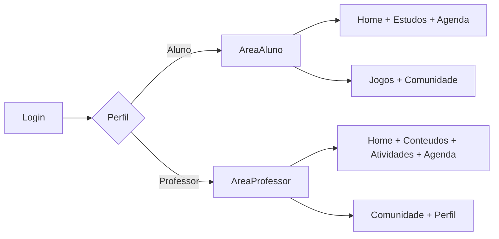

# Product Vision

## Objetivo

Documentar uma visao inicial do produto REMA a partir do fluxograma enviado,
servindo como base para refinamentos futuros de negocio, UX e API.

## Proposta Inicial

O REMA nasce como uma plataforma educacional com duas experiencias principais:

- `Aluno`: consumir conteudos, acompanhar provas e atividades, organizar a
  rotina, participar de comunidade e interagir com recursos ludicos.
- `Professor`: publicar conteudos, criar atividades, acompanhar o calendario e
  interagir com uma comunidade profissional.

O modulo academico passa a ter tres objetos pedagogicos principais:

- `Prova`: conjunto de questoes avaliativas
- `Atividade`: conjunto de questoes avaliativas
- `Trabalho`: atividade com descricao livre e envio de arquivo pelo aluno

## Perfis Atendidos

- `Aluno`
- `Professor`

Ambos entram por um fluxo unico de autenticacao e sao direcionados para uma
experiencia adaptada ao seu papel.

## Problemas Que o Produto Parece Resolver

### Para Aluno

- Dificuldade para centralizar atividades, provas e materiais
- Falta de visibilidade da rotina academica
- Baixo engajamento em ambientes de estudo tradicionais

### Para Professor

- Dificuldade para organizar e publicar materiais em um unico ambiente
- Falta de um espaco central para acompanhar atividades e eventos
- Necessidade de troca entre pares em uma comunidade propria

## Proposta de Valor Inicial

- Centralizar rotina academica em um unico sistema
- Entregar experiencias diferentes para aluno e professor sobre a mesma base
- Combinar produtividade academica com elementos de engajamento

## Modulos Iniciais

- `Login`
- `Home`
- `Provas / atividades / trabalhos`
- `Conteudos`
- `Calendario`
- `Comunidade`
- `Perfil`
- `Jogos` para aluno

## Regras Estruturais Ja Conhecidas

### Avaliacoes

- `Provas` e `Atividades` sao conjuntos de questoes
- Cada `Prova` ou `Atividade` pode ter ate `100` questoes
- A pontuacao total de `Provas`, `Atividades` e `Trabalhos` deve ser `100`
- Quando houver pontuacao por questao, a soma das questoes deve ser
  obrigatoriamente `100`
- Cada questao pode ser:
  - `dissertativa`
  - `multipla escolha` com ate `5` opcoes
- A questao pode conter imagem para interpretacao
- A questao possui explicacao esperada ou gabarito de apoio, nao visivel ao
  aluno no momento da realizacao
- O sistema precisa registrar status de envio do aluno

### Trabalhos

- `Trabalho` e tratado como um tipo de atividade
- Deve conter descricao do que precisa ser feito
- O aluno envia um arquivo `PDF`, `Word` ou `TXT`
- O professor devolve nota com comentario obrigatorio

### Conteudos

- Campos obrigatorios:
  - `titulo`
  - `subtitulo`
  - `descricao`
  - `data de postagem`
  - `autor`
- Campos opcionais:
  - `imagem`
  - `video`
- O professor cria, edita e exclui
- O aluno apenas le

### Comunidade

- `Aluno` cria post com `texto`, `imagem`, `video` ou `gif`
- Post de aluno precisa de aprovacao de ao menos um professor para se tornar
  visivel para outros alunos
- `Professor` cria post visivel apenas para professores
- `Professor` ve posts de professores e tambem os posts dos alunos para moderar

### Calendario

- Deve conversar com datas de entrega de provas, atividades e trabalhos
- Deve permitir anotacoes pessoais do aluno

### Jogos

- Deve haver de `4` a `5` jogos com foco em inteligencia e estimulo cognitivo
- E aceitavel usar biblioteca externa ou API externa

## Priorizacao Recomendada

### Nucleo do produto

- `Login`
- `Home`
- `Provas / atividades / trabalhos`
- `Conteudos`
- `Calendario`

### Suporte de conta e continuidade

- `Perfil`

### Engajamento e relacionamento

- `Comunidade`
- `Jogos`

## Leitura de Prioridade

Os cinco modulos do nucleo devem ser tratados como o centro funcional do
produto porque sustentam a rotina diaria de estudo e ensino. `Perfil` entra em
seguida por ser complementar ao uso recorrente. `Comunidade` e `Jogos` devem
ser mantidos flexiveis ate que a proposta pedagogica esteja mais clara, embora
`Comunidade` ja tenha uma regra de moderacao importante desde o inicio.

## Navegacao Macro

## Hipoteses de MVP

- O sistema inicia com dois papeis bem definidos
- O acesso e autenticado
- A maior parte do valor inicial vem de `provas`, `atividades`, `trabalhos`,
  `conteudos` e `calendario`
- `Jogos` pode entrar como piloto ou experimento, nao obrigatoriamente como
  parte do primeiro ciclo funcional

## Riscos de Produto

- `Jogos` pode aumentar escopo cedo demais sem clareza pedagogica
- `Comunidade` exige moderacao desde o primeiro dia por depender de aprovacao de
  posts de alunos
- `Provas / atividades` pode se tornar complexo rapidamente se misturar
  criacao, entrega, correcao, nota, comentarios e anexos sem recorte inicial
