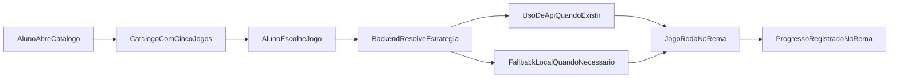

# Wave 10: Five Curated Games

## Objetivo

Redefinir a wave 10 para trabalhar com um catálogo fixo de 5 jogos pedagógicos,
priorizando uso de APIs externas quando houver opção viável e segura, com
fallback para implementação local dentro do REMA quando necessário.

## Resultado Esperado

- catálogo com exatamente 5 jogos definidos por produto
- uso de API externa apenas quando ela fizer sentido para a mecânica
- fallback local claro quando a API não existir, for instável ou não entregar
  qualidade pedagógica suficiente
- reaproveitamento da base da `Wave 6` sem voltar ao catálogo externo genérico

## Jogos Alvo

1. `Forca`
2. `Sudoku`
3. `Quiz de Português`
4. `Quiz de Matemática`
5. `Labirinto`

## Entradas

- `docs/product-vision.md`
- `docs/api-discovery.md`
- `docs/domain-map.md`
- `docs/transformation/wave-6-games.md`

## Diretriz Geral

- o browser nunca conversa diretamente com providers externos
- o backend do REMA decide quando usar API e quando cair para fallback local
- o catálogo não deve ser aberto nem sincronizado genericamente com marketplaces
- cada jogo terá estratégia própria, mas todos devem continuar cabendo no shell de
  jogos da `Wave 6`

## Micro-wave 10.1: Catálogo Curado

### Escopo

Trocar a ideia de catálogo externo genérico por um catálogo fixo de 5 experiências.

### Regras base

- manter exatamente 5 jogos no catálogo
- cada jogo precisa de slug estável e descrição pedagógica
- cada item deve declarar sua estratégia de origem:
  - `remote_api`
  - `local_engine`
  - `hybrid`

## Micro-wave 10.2: Forca

### Estratégia preferencial

Usar API pública de palavra aleatória em PT-BR como fonte do termo.

### Candidata principal

- `random-word-api` com `lang=pt-br`

### Fallback

- lista local curada de palavras no REMA

### Observações

- a API precisa fornecer palavra sem expor pista inadequada
- o jogo em si deve rodar no REMA; a API só precisa fornecer o insumo textual

## Micro-wave 10.3: Sudoku

### Estratégia preferencial

Usar API pública sem autenticação para gerar tabuleiro e solução.

### Candidata principal

- `Dosuku` (`https://sudoku-api.vercel.app/api/dosuku`)

### Fallback

- gerador local de sudoku

### Observações

- a API deve ser usada para gerar puzzle e, se necessário, solução
- o estado da jogada continua controlado pelo REMA

## Micro-wave 10.4: Quiz de Português

### Estratégia preferencial

Implementar localmente no REMA.

### Motivo

- não há evidência forte de API pública confiável e pedagógica com perguntas e
  respostas de português em português

### Escopo mínimo

- banco local de perguntas e respostas
- níveis simples de dificuldade
- correção objetiva

## Micro-wave 10.5: Quiz de Matemática

### Estratégia preferencial

Usar API pública de quiz como fonte inicial de perguntas e respostas.

### Candidata principal

- `Open Trivia DB`, categoria de matemática

### Fallback

- banco local de perguntas no REMA

### Observações

- o backend deve normalizar a pergunta antes de expor ao front
- se o conteúdo da API não servir para o contexto pedagógico, o fallback local
  passa a ser a estratégia principal

## Micro-wave 10.6: Labirinto

### Estratégia preferencial

Usar API pública que gere labirintos em JSON.

### Candidata principal

- `https://guillaumeroux.fr/maze/?rows=...&cols=...&json`

### Fallback

- gerador local de labirinto no REMA

### Observações

- a API deve fornecer a estrutura do labirinto
- a navegação, colisão e objetivo do jogador devem ficar no próprio REMA

## Estratégia Técnica Recomendada

Em vez de sincronizar catálogo de terceiros, o REMA deve modelar 5 jogos fixos e
resolver cada um por estratégia própria:

- `remote_api`: backend consulta API e devolve payload pronto ao front
- `local_engine`: backend e/ou front geram a experiência no próprio sistema
- `hybrid`: backend busca insumos e o jogo roda no front do REMA

## Reaproveitamento Da Wave 6

### Manter

- modelo `Game`
- modelo `GameSession`
- endpoints REST de catálogo, detalhe e histórico
- tela base de jogos do aluno

### Evoluir

- catálogo seeded passa a representar os 5 jogos finais
- payloads de detalhe podem ganhar campos específicos por tipo de jogo
- fluxo de progresso deixa de ser genérico e passa a refletir a mecânica de cada
  experiência

## Fluxo Base

## Dependências

- depende de `Wave 6`

## Critério de Pronto

- wave 10 deixa de falar em catálogo externo genérico
- os 5 jogos estão definidos nominalmente
- cada jogo tem decisão inicial entre API e fallback local
- a base reaproveitada da `Wave 6` está documentada

## Riscos

- depender de APIs públicas instáveis sem fallback local
- escolher APIs que só entregam insumo bruto e não a experiência completa sem
  prever implementação no REMA
- insistir em API externa para quiz de português sem qualidade pedagógica
- misturar novamente catálogo aberto com catálogo curado
