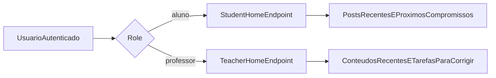

# Wave 12: Home Summaries

## Objetivo

Evoluir as homes de `aluno` e `professor` de placeholders para painéis úteis de
entrada, exibindo resumos curtos e acionáveis com base em dados já existentes
de comunidade, calendário, conteúdos e correções pendentes.

## Resultado Esperado

- a home do aluno mostra `3 posts recentes` da comunidade
- a home do aluno mostra `3 próximos compromissos` em formato textual
- a home do professor mostra `3 conteúdos recentes`
- a home do professor mostra até `5 tarefas` com envios que ainda precisam de
  correção
- as homes deixam de ser placeholders e passam a funcionar como resumo
  operacional

## Entradas

- `docs/product-vision.md`
- `docs/user-flows.md`
- `docs/modules/aluno.md`
- `docs/modules/professor.md`
- `apps/web/src/app/aluno/page.tsx`
- `apps/web/src/app/professor/page.tsx`
- `apps/web/src/lib/api.ts`
- `apps/api/core/urls.py`
- `apps/api/core/community_views.py`
- `apps/api/core/calendar_views.py`
- `apps/api/core/content_views.py`
- `apps/api/core/submissions_views.py`
- `packages/contracts/src/index.ts`

## Diretriz Geral

- a home deve ser resumida, não uma página de listagem completa
- o backend deve devolver payloads já ordenados e limitados para evitar
  composição excessiva no frontend
- o aluno deve ver apenas dados já visíveis para seu papel
- o professor deve ver apenas conteúdo próprio e pendências reais de correção

## Micro-wave 12.1: Contratos de Home

### Escopo

Adicionar tipos compartilhados para os payloads de resumo de `aluno` e
`professor`.

### Payloads sugeridos

- `StudentHomeSummary`
  - `recentPosts`
  - `upcomingItems`
- `TeacherHomeSummary`
  - `recentContents`
  - `pendingReviews`

### Regra base

- os contratos devem reaproveitar tipos já existentes sempre que possível
- apenas o mínimo necessário deve ser introduzido como tipo novo

## Micro-wave 12.2: Backend da Home do Aluno

### Escopo

Criar endpoint que entregue os `3 posts recentes` e os `3 próximos compromissos`
do aluno já ordenados e limitados.

### Fonte de dados

- feed aprovado da comunidade
- eventos de calendário do aluno
- notas pessoais futuras do aluno

### Regras

- considerar apenas posts já visíveis ao aluno
- considerar apenas itens futuros em compromissos
- ordenar compromissos por data ascendente
- limitar cada bloco ao recorte pedido pela home

## Micro-wave 12.3: Backend da Home do Professor

### Escopo

Criar endpoint que entregue `3 conteúdos recentes` e até `5 tarefas` com envios
pendentes de correção.

### Fonte de dados

- conteúdos do professor
- tarefas do professor com submissões em status `submitted`

### Regras

- ordenar conteúdos por recência útil
- ordenar pendências por data de envio
- incluir dados suficientes para link direto à correção

## Micro-wave 12.4: Cliente API do Web

### Escopo

Adicionar funções dedicadas para consumir os novos endpoints de home.

### Saída mínima

- `apiStudentHomeSummary(token)`
- `apiTeacherHomeSummary(token)`

## Micro-wave 12.5: UI da Home do Aluno

### Escopo

Substituir o placeholder atual por uma home com dois blocos principais.

### Blocos

- `Posts recentes`
  - listar até `3` cards curtos com título, trecho e contexto visual
- `Próximos compromissos`
  - listar até `3` itens textuais com tipo, título e data

### Observações

- não precisa exibir o calendário visual nesta wave
- o foco é leitura rápida da rotina imediata

## Micro-wave 12.6: UI da Home do Professor

### Escopo

Substituir o placeholder atual por uma home com dois blocos principais.

### Blocos

- `Conteúdos recentes`
  - listar até `3` itens com status e data
- `Tarefas para corrigir`
  - listar até `5` pendências com aluno, tarefa e data do envio

### Observações

- a prioridade da home do professor deve ser operacional
- o bloco de correção deve apontar diretamente para a ação principal

## Fluxo Base

## Dependências

- depende de `Wave 1`
- reaproveita módulos já implementados de comunidade, calendário, conteúdos e
  tarefas

## Critério de Pronto

- as homes de aluno e professor deixam de ser placeholders
- os limites de `3`, `3`, `3` e `5` itens são respeitados no backend
- a home do aluno combina posts e compromissos futuros corretamente
- a home do professor mostra apenas pendências reais de correção
- os cards apontam para áreas úteis do sistema quando aplicável

## Riscos

- montar tudo no frontend com muitas chamadas e lógica duplicada
- misturar posts pendentes com posts já visíveis ao aluno
- trazer compromissos passados por falta de filtro temporal
- listar envios já corrigidos como se ainda precisassem de ação
