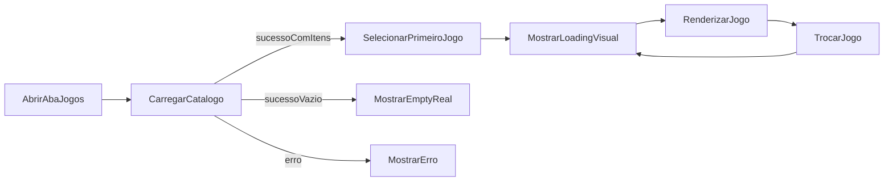

# Wave 13: Student Games Loading

## Objetivo

Corrigir a experiência de carregamento da aba `Jogos` do aluno para que a tela
não mostre `Nenhum jogo disponível.` enquanto o catálogo ainda estiver em fetch
e para que a troca entre jogos não mantenha o jogo anterior como se ele ainda
estivesse ativo.

## Resultado Esperado

- a aba `Jogos` mostra loading explícito no primeiro acesso
- a frase `Nenhum jogo disponível.` aparece apenas em vazio real do catálogo
- a troca entre jogos mostra um estado visual intermediário dedicado
- o jogo anterior deixa de ficar aparente como conteúdo ativo durante a troca
- o loading visual fica coerente com a identidade atual do aluno

## Entradas

- `docs/transformation/wave-10-external-games.md`
- `apps/web/src/app/aluno/jogos/page.tsx`
- `apps/web/src/app/aluno/jogos/page.module.css`
- `apps/web/src/lib/api.ts`
- `packages/contracts/src/games/types.ts`

## Diretriz Geral

- separar claramente `loading`, `empty`, `error` e `ready`
- resolver o problema no cliente sempre que possível
- evitar bibliotecas novas só para animação ou skeleton
- manter o escopo local à tela de jogos do aluno

## Micro-wave 13.1: Estados Explícitos da Tela

### Escopo

Definir estados próprios para o carregamento do catálogo e do jogo
selecionado.

### Regras

- `gamesLoading` cobre o carregamento inicial do catálogo
- `loadingGameId` cobre a abertura ou troca do jogo selecionado
- `empty` só aparece depois do término do carregamento inicial
- `error` não deve reaproveitar o mesmo bloco visual do vazio real

## Micro-wave 13.2: Loading Inicial do Catálogo

### Escopo

Substituir o falso empty state inicial por um loading visual com skeleton na
lista e placeholder no painel principal.

### Capacidades mínimas

- skeleton cards no catálogo
- painel principal com mensagem contextual de carregamento
- transição limpa para o estado real após o primeiro fetch

## Micro-wave 13.3: Loading de Troca de Jogo

### Escopo

Neutralizar o jogo anterior enquanto o novo `detail` e o novo `runtime` são
carregados.

### Regras

- limpar `selectedGame` e `runtime` ao iniciar a troca
- destacar na lista qual jogo está sendo carregado
- evitar reentrada acidental durante o carregamento
- impedir que o conteúdo anterior continue parecendo interativo

## Micro-wave 13.4: Loading Visual Refinado

### Escopo

Aplicar um loading com aparência mais agradável, mantendo implementação leve.

### Elementos recomendados

- gradiente leve
- shimmer simples em CSS
- copy contextual como `Preparando jogo...`
- barra de progresso visual não semântica para reforçar percepção de avanço

## Micro-wave 13.5: Validação da UX

### Checklist mínimo

- abrir `/aluno/jogos` e observar loading inicial
- validar que o catálogo não mostra vazio falso antes do fetch
- trocar rapidamente entre jogos e confirmar substituição do conteúdo anterior
- confirmar distinção entre loading, erro e vazio real
- validar lint e build do frontend após a mudança

## Fluxo Base

## Dependências

- depende funcionalmente da `Wave 10`
- reutiliza o shell autenticado já existente da área do aluno

## Critério de Pronto

- a aba `Jogos` não mostra `Nenhum jogo disponível.` durante o fetch inicial
- a primeira seleção do catálogo entra em loading explícito
- a troca entre jogos mostra loading próprio e não mantém o jogo anterior como
  estado aparentemente ativo
- o loading visual é agradável e simples de manter
- a solução permanece local ao frontend

## Riscos

- sobrepor loading e conteúdo antigo ao mesmo tempo
- resolver apenas o primeiro acesso e deixar a troca ainda travada
- transformar um ajuste local em refatoração maior do módulo de jogos
