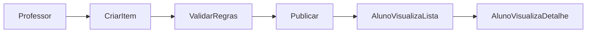

# Wave 2: Academic Core

## Objetivo

Entregar o coração do REMA: criação, publicação e consulta de `Provas`,
`Atividades` e `Trabalhos`.

## Resultado Esperado

- professor cria itens acadêmicos
- aluno consulta lista e detalhe
- regras críticas de estrutura e pontuação ficam protegidas

## Entradas

- `docs/product-vision.md`
- `docs/user-flows.md`
- `docs/domain-map.md`
- `docs/api-discovery.md`

## Micro-wave 2.1: Activity Model

### Escopo

Consolidar `Activity` como entidade central com `kind`:

- `prova`
- `atividade`
- `trabalho`

### Campos base

- `title`
- `description`
- `kind`
- `status`
- `due_at`
- `total_score`
- `created_by`

## Micro-wave 2.2: Regras de Criacao

### Escopo

Documentar validacoes obrigatorias no fluxo do professor.

### Regras

- `prova` e `atividade` aceitam ate `100` questoes
- a pontuacao total do item deve ser `100`
- a soma dos pesos das questoes deve ser `100`
- `trabalho` precisa de descricao clara do que deve ser feito

## Micro-wave 2.3: Question Model

### Escopo

Definir estrutura de questoes.

### Tipos

- `dissertativa`
- `multipla_escolha`

### Regras

- questao pode conter imagem
- questao de multipla escolha aceita ate `5` opcoes
- explicacao esperada ou gabarito nao ficam visiveis ao aluno

## Micro-wave 2.4: Experiencia do Professor

### Escopo

Planejar as views do professor para:

- listar itens criados
- criar novo item
- editar item em `draft`
- publicar item
- consultar detalhe

### Componentes esperados

- lista de itens
- formulario base
- editor de questoes
- resumo de validacao de pontuacao

## Micro-wave 2.5: Experiencia do Aluno

### Escopo

Planejar as views do aluno para:

- listar itens disponiveis
- ver detalhe
- entender prazo e tipo

### Informacoes criticas na view

- titulo
- tipo
- status
- prazo
- pontuacao total

## Micro-wave 2.6: Lifecycle do Item Academico

### Escopo

Definir estados do item antes da submissao do aluno.

### Estados sugeridos

- `draft`
- `published`
- `closed`
- `archived`

## Fluxo Base

## Dependencias

- depende de `Wave 1`

## Critério de Pronto

- modelo de `Activity` estabilizado
- regras de pontuacao documentadas
- fluxo de criacao e publicacao do professor especificado
- fluxo de listagem e detalhe do aluno especificado

## Riscos

- deixar `trabalho` excessivamente preso ao mesmo fluxo de questoes
- permitir estados demais cedo
- misturar criacao e publicacao sem validacao suficiente
