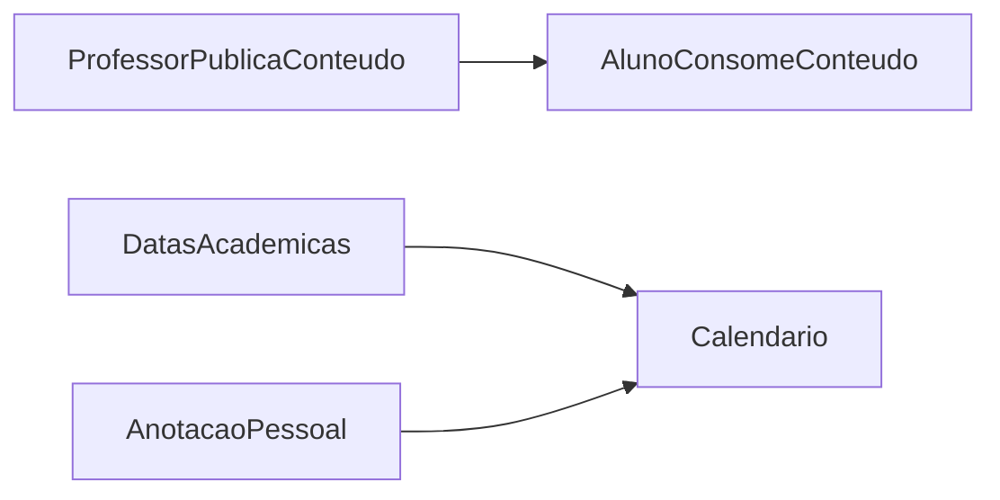

# Wave 4: Content and Calendar

## Objetivo

Entregar dois modulos de apoio direto ao núcleo acadêmico: publicação de
conteúdo e calendário conectado aos prazos do sistema.

## Resultado Esperado

- professor cria e gerencia conteúdos
- aluno consome conteúdos
- calendário mostra entregas automaticamente
- aluno registra notas pessoais

## Entradas

- `docs/product-vision.md`
- `docs/user-flows.md`
- `docs/domain-map.md`
- `docs/api-discovery.md`

## Micro-wave 4.1: Content Spec

### Escopo

Fechar o spec de `Content`.

### Campos obrigatorios

- `title`
- `subtitle`
- `description`
- `published_at`
- `author`

### Campos opcionais

- `image_url`
- `video_url`

## Micro-wave 4.2: Gestao de Conteudo pelo Professor

### Escopo

Planejar as capacidades do professor para:

- criar
- editar
- excluir
- publicar

### Componentes esperados

- lista de conteúdos
- formulario de conteúdo
- detalhe com preview

## Micro-wave 4.3: Leitura de Conteudo pelo Aluno

### Escopo

Planejar a experiencia do aluno para:

- listar conteúdos
- abrir detalhes
- consumir mídia quando existir

## Micro-wave 4.4: Calendario Academico

### Escopo

Definir a integração do calendário com:

- `due_at` de provas
- `due_at` de atividades
- `due_at` de trabalhos

### Eventos esperados

- prazo de entrega
- possivel data de prova
- eventos gerais acadêmicos, se existirem

## Micro-wave 4.5: Notas Pessoais do Aluno

### Escopo

Planejar anotacoes individuais sem impacto global.

### Regras

- visiveis apenas para o proprio aluno
- nao afetam calendário do professor
- possuem periodo e descricao

## Micro-wave 4.6: Biblioteca de Calendario

### Escopo

Avaliar a estrategia tecnica para `web` e `mobile`.

### Criterios

- suporte a lista e calendario
- boa experiencia em mobile
- facilidade de integracao com eventos do backend

## Fluxo Base

## Dependencias

- depende parcialmente de `Wave 2`

## Critério de Pronto

- CRUD de conteúdo especificado
- leitura de conteúdo pelo aluno bem definida
- calendário conectado a entregas documentado
- notas pessoais do aluno especificadas

## Riscos

- superdimensionar o editor de conteúdo cedo
- tratar calendário apenas como componente visual sem regra de domínio
- misturar evento global com nota pessoal do aluno
