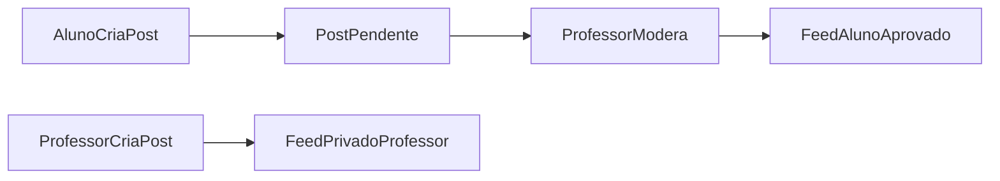

# Wave 5: Profile and Community

## Objetivo

Entregar identidade básica de conta e comunidade com moderacao segura para
alunos e professores.

## Resultado Esperado

- perfil funcional nos dois papeis
- comunidade de professores ativa
- comunidade de alunos protegida por aprovacao

## Entradas

- `docs/product-vision.md`
- `docs/user-flows.md`
- `docs/domain-map.md`
- `docs/api-discovery.md`

## Micro-wave 5.1: Perfil Base

### Escopo

Definir o recorte minimo de perfil para `Aluno` e `Professor`.

### Campos esperados

- nome de exibicao
- foto de perfil
- preferencias
- bio opcional para professor

## Micro-wave 5.2: Leitura e Edicao de Perfil

### Escopo

Planejar:

- leitura do perfil atual
- edicao de campos permitidos
- upload ou troca de avatar

## Micro-wave 5.3: Comunidade do Aluno

### Escopo

Planejar o espaco de postagem do aluno.

### Regras

- aluno cria post com `texto`, `imagem`, `video` ou `gif`
- o post nasce em estado pendente
- outros alunos so veem o post aprovado

## Micro-wave 5.4: Comunidade do Professor

### Escopo

Planejar espaco privado entre professores.

### Regras

- posts de professor sao visiveis apenas para professores
- professores interagem entre si sem passar por moderacao

## Micro-wave 5.5: Moderacao

### Escopo

Definir fluxo de aprovacao e rejeicao de posts de aluno.

### Regras

- ao menos um professor aprova para publicar
- rejeicao deve poder registrar motivo no futuro
- professores precisam listar pendencias de moderacao

## Micro-wave 5.6: Segmentacao de Feed

### Escopo

Planejar listagens por `audience` e `status`.

### Listagens minimas

- feed aprovado do aluno
- fila de moderacao do professor
- feed privado de professores

## Fluxo Base

## Dependencias

- depende de `Wave 1`
- aproveita perfil e autenticacao

## Critério de Pronto

- perfil base bem recortado
- fluxo de moderacao documentado
- feeds segmentados por papel definidos

## Riscos

- tratar comunidade como feed generico sem regra de papel
- deixar moderacao pouco clara
- misturar perfil e comunidade em uma unica entrega sem separacao de escopo
