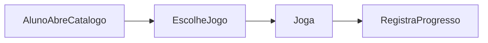

# Wave 6: Games

## Objetivo

Adicionar uma camada de engajamento para o aluno sem acoplar cedo demais esse
modulo ao núcleo acadêmico.

## Resultado Esperado

- catálogo de jogos visível ao aluno
- entre `4` e `5` jogos definidos
- progresso e score registrados

## Entradas

- `docs/product-vision.md`
- `docs/user-flows.md`
- `docs/domain-map.md`
- `docs/api-discovery.md`

## Micro-wave 6.1: Estrategia de Jogos

### Escopo

Definir se os jogos serao:

- nativos da plataforma
- incorporados via biblioteca externa
- integrados por API externa

### Criterios

- tempo de entrega
- aderencia ao mobile
- custo de manutencao

## Micro-wave 6.2: Catalogo

### Escopo

Planejar a area de descoberta dos jogos.

### Informacoes minimas

- nome
- descricao curta
- tipo de experiencia
- status de disponibilidade

## Micro-wave 6.3: Sessao e Progresso

### Escopo

Planejar registro de uso.

### Dados minimos

- `student_id`
- `game_id`
- `score`
- `progress`
- `played_at`

## Micro-wave 6.4: Acoplamento com o Núcleo

### Escopo

Decidir o nivel de relacao entre jogos e o restante do produto.

### Caminhos possiveis

- jogos independentes
- jogos relacionados a conteúdos
- jogos relacionados a atividades

### Recomendacao inicial

Comecar com jogos independentes e deixar integração pedagógica para evolução
posterior.

## Fluxo Base

## Dependencias

- depende da autenticacao e da area do aluno
- deve entrar depois da estabilidade do núcleo acadêmico

## Critério de Pronto

- estratégia técnica dos jogos definida
- catálogo base especificado
- modelo de progresso documentado
- relação com o núcleo decidida

## Riscos

- aumentar demais o escopo do produto cedo
- depender de fornecedor externo sem validação
- tentar conectar desempenho do jogo à avaliação formal cedo demais
