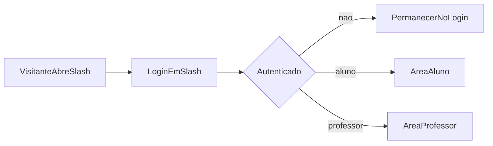

# Wave 7: Login Entry

## Objetivo

Transformar `http://localhost:3000/` na porta única de entrada da aplicação web.

## Resultado Esperado

- `/` vira a tela principal de login
- `/login` passa a ser rota legada compatível
- fluxos autenticados deixam de depender de uma landing pública separada

## Entradas

- `docs/product-vision.md`
- `docs/user-flows.md`
- `docs/transformation/wave-1-auth-and-shell.md`
- `docs/transformation/wave-1-auth-spec.md`

## Micro-wave 7.1: Rota de Entrada

### Escopo

Definir o comportamento oficial de:

- `/`
- `/login`
- redirecionamento pós-login

### Regra base

- visitante abre `/` e vê login
- usuário autenticado em `/` vai para sua área por papel

## Micro-wave 7.2: Middleware e Guards

### Escopo

Revisar o `middleware` e os guards do web para alinhar autenticação com a nova rota principal.

### Pontos de atenção

- proteger `/aluno/*`
- proteger `/professor/*`
- redirecionar `/login` para `/`, se mantida
- evitar duplicação de lógica entre `middleware` e componentes clientes

## Micro-wave 7.3: Fluxos Internos

### Escopo

Atualizar fluxos que hoje fazem `replace("/login")`.

### Casos mínimos

- perda de sessão
- logout
- acesso sem token

## Micro-wave 7.4: Compatibilidade

### Escopo

Preservar compatibilidade temporária da rota `/login` para bookmarks e testes.

### Estratégia sugerida

- manter `/login` como alias ou redirecionamento para `/`

## Fluxo Base

## Dependencias

- depende de `Wave 1`

## Critério de Pronto

- `/` definido como entrada oficial
- `/login` com comportamento documentado
- regras de redirecionamento mapeadas

## Riscos

- manter duas entradas concorrentes para login
- espalhar redirecionamentos inconsistentes pelo web
- criar loops de navegação entre `/` e `/login`
