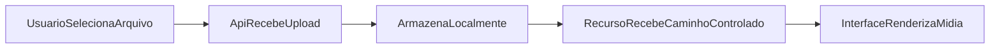

# Wave 8: Local Media

## Objetivo

Eliminar a dependência de URLs arbitrárias para imagens e mídias relevantes,
salvando arquivos localmente pela API.

## Resultado Esperado

- avatar salvo localmente
- conteúdos com mídia local
- comunidade com mídia local
- imagens de apoio das atividades salvas localmente

## Entradas

- `docs/product-vision.md`
- `docs/api-discovery.md`
- `docs/domain-map.md`
- `docs/transformation/wave-5-profile-and-community.md`

## Micro-wave 8.1: Infraestrutura de Midia

### Escopo

Definir a base técnica de upload e serving local.

### Itens minimos

- `MEDIA_ROOT`
- `MEDIA_URL`
- rota de acesso em desenvolvimento
- regra de armazenamento por contexto

## Micro-wave 8.2: Avatar e Perfil

### Escopo

Trocar `avatarUrl` textual por upload local real.

### Pontos minimos

- upload do arquivo
- persistência no backend
- retorno de caminho público controlado pela API

## Micro-wave 8.3: Conteudos e Comunidade

### Escopo

Levar upload local para módulos com mídia editorial e social.

### Casos minimos

- imagem de conteúdo
- vídeo de conteúdo
- imagem, vídeo e gif em comunidade

## Micro-wave 8.4: Imagem de Apoio das Atividades

### Escopo

Trocar URL manual da questão por imagem local vinculada ao item acadêmico.

### Regras minimas

- upload associado ao fluxo do professor
- exibição segura no detalhe do professor e do aluno

## Micro-wave 8.5: Validacao

### Escopo

Definir validações por tipo de mídia.

### Regras minimas

- formatos permitidos por contexto
- limite de tamanho
- mensagens de erro claras

## Fluxo Base

## Dependencias

- depende de `Wave 5`
- se beneficia de `Wave 7`

## Critério de Pronto

- infraestrutura de mídia documentada
- escopo por módulo definido
- formatos e limites registrados

## Riscos

- misturar upload genérico sem regras por contexto
- servir arquivos locais sem configuração clara
- manter metade do sistema em URL manual e metade em mídia local
