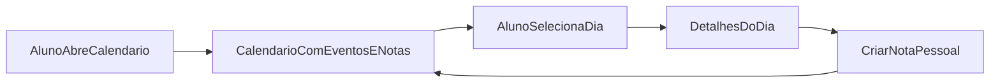

# Wave 9: Student Calendar UI

## Objetivo

Transformar o calendário do aluno em uma visão visual de agenda comum, mantendo
os prazos acadêmicos e as notas pessoais no mesmo contexto.

## Resultado Esperado

- aluno vê um calendário visual real
- prazos acadêmicos aparecem na agenda
- notas pessoais do aluno aparecem na mesma visão
- leitura por mês e dia fica mais natural

## Entradas

- `docs/product-vision.md`
- `docs/user-flows.md`
- `docs/transformation/wave-4-content-and-calendar.md`
- `docs/transformation/wave-4-content-calendar-spec.md`

## Micro-wave 9.1: Visao de Calendario

### Escopo

Definir a experiência visual principal do aluno.

### Capacidades minimas

- navegar por mês
- visualizar eventos por dia
- identificar rapidamente a densidade de compromissos

## Micro-wave 9.2: Unificacao de Eventos

### Escopo

Exibir no mesmo calendário:

- prazos derivados de `Activity.due_at`
- eventos manuais
- notas pessoais do aluno

### Regra base

- todos os itens devem entrar na mesma grade temporal

## Micro-wave 9.3: Diferenciacao Visual

### Escopo

Definir como cada origem será destacada.

### Categorias minimas

- prazo acadêmico
- evento manual
- nota pessoal

## Micro-wave 9.4: Interacao do Aluno

### Escopo

Manter o aluno capaz de registrar suas notas pessoais sem perder a leitura do
calendário.

### Capacidades minimas

- criar nota pessoal
- localizar a nota no calendário
- abrir detalhe textual do item selecionado

## Micro-wave 9.5: Escalabilidade da API

### Escopo

Avaliar se a API atual suporta a visão visual sem ajustes imediatos.

### Ponto de decisão

- manter `GET /api/calendar/events/` como está
- ou introduzir filtro por intervalo no futuro

## Fluxo Base

## Dependencias

- depende de `Wave 4`

## Critério de Pronto

- visão visual do calendário especificada
- unificação entre eventos e notas documentada
- comportamento mínimo do aluno descrito

## Riscos

- tratar calendário só como lista estilizada
- misturar tipos de evento sem diferenciação clara
- introduzir biblioteca visual sem validar integração com o payload atual
