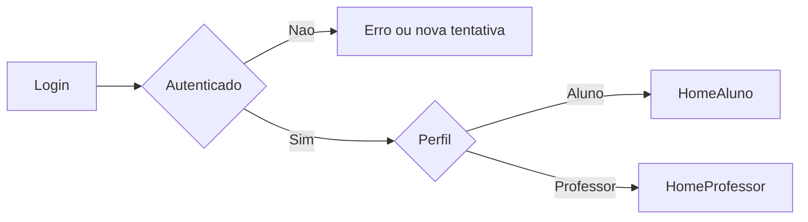

# User Flows

## Objetivo

Descrever as jornadas minimas dos fluxos vistos no diagrama, com foco em
entrada, navegacao e valor principal de cada view.

## Fluxo Macro

## Jornada: Login

### Entrada

- Usuario acessa app web ou mobile
- Encontra tela unica de autenticacao

### Passos minimos

1. Informar credenciais
2. Validar autenticacao
3. Identificar papel do usuario
4. Redirecionar para area correta

### Estados minimos

- carregando
- sucesso
- credencial invalida
- sessao expirada
- usuario sem permissao

## Jornada do Aluno

### Home do Aluno

Objetivo:
Dar visibilidade imediata da rotina do estudante.

Conteudo esperado:

- proximas atividades
- proximas provas
- proximos trabalhos
- destaques de conteudos
- agenda do dia ou da semana
- atalhos para jogos e comunidade

Saidas:

- acessar atividades
- abrir conteudos
- abrir calendario
- ir para jogos
- ir para comunidade
- abrir perfil

### Provas / Atividades / Trabalhos do Aluno

Objetivo:
Permitir ao aluno acompanhar o que precisa fazer.

Passos minimos:

1. Ver lista de provas, atividades e trabalhos
2. Entrar no detalhe de um item
3. Entender prazo, status e orientacoes
4. Responder questoes ou anexar arquivo
5. Confirmar envio
6. Acompanhar resultado depois da avaliacao

Regras conhecidas:

- `Prova` e `Atividade` sao compostas por questoes
- `Trabalho` exige upload de `PDF`, `Word` ou `TXT`
- O aluno so pode enviar uma vez
- Depois do envio nao pode editar nem reenviar
- O aluno deve ver uma confirmacao antes do envio final
- A view pode ser reaproveitada para consulta posterior de nota e retorno
- Questoes podem ser:
  - dissertativas
  - multipla escolha com ate `5` opcoes
- Questoes podem conter imagem
- Explicacao de resposta nao fica visivel durante a realizacao

Estados desejados:

- pendente
- em andamento
- entregue
- corrigido
- expirado

### Conteudos do Aluno

Objetivo:
Permitir descoberta e consumo de materiais.

Passos minimos:

1. Ver lista de conteudos
2. Filtrar ou navegar por categoria
3. Abrir detalhe
4. Consumir material

Informacoes minimas da view:

- titulo
- subtitulo
- descricao
- autor
- data de postagem
- imagem ou video quando houver

### Calendario do Aluno

Objetivo:
Organizar a rotina e antecipar prazos.

Passos minimos:

1. Visualizar eventos e prazos
2. Abrir detalhes do evento
3. Navegar entre periodos
4. Criar anotacoes pessoais individuais

Eventos base esperados:

- entregas de atividades
- entregas de provas
- entregas de trabalhos
- anotacoes do proprio aluno

### Jogos do Aluno

Objetivo:
Estimular aprendizagem e engajamento.

Passos minimos:

1. Ver catalogo ou area de jogos
2. Escolher experiencia
3. Iniciar interacao
4. Ver retorno de progresso ou pontuacao, se existir

Escopo base:

- entre `4` e `5` jogos
- possibilidade de uso de biblioteca externa ou API externa

### Comunidade do Aluno

Objetivo:
Criar espaco de interacao entre alunos.

Passos minimos:

1. Ver feed, mural ou topicos
2. Criar post com texto, imagem, video ou gif
3. Acompanhar status de moderacao
4. Interagir em posts aprovados

Regra central:

- post de aluno so fica visivel para outros alunos apos aprovacao de professor

### Perfil do Aluno

Objetivo:
Gerenciar informacoes pessoais e preferencias.

Passos minimos:

1. Visualizar dados do perfil
2. Editar informacoes permitidas
3. Ajustar preferencias
4. Atualizar foto de perfil

## Jornada do Professor

### Home do Professor

Objetivo:
Ser a central operacional do trabalho diario.

Conteudo esperado:

- atividades recentes
- trabalhos pendentes de avaliacao
- conteudos criados ou pendentes
- eventos do calendario
- atalhos para comunidade e perfil

Saidas:

- criar ou abrir atividades
- abrir conteudos
- abrir calendario
- abrir comunidade
- abrir perfil

### Provas / Atividades / Trabalhos do Professor

Objetivo:
Permitir criar e acompanhar atividades.

Passos minimos:

1. Ver lista de atividades
2. Escolher se vai criar prova, atividade ou trabalho
3. Configurar informacoes principais
4. Montar questoes ou descricao do trabalho
5. Validar pontuacao
6. Publicar
7. Acompanhar entregas e status
8. Corrigir e registrar nota

Regras conhecidas:

- provas e atividades possuem ate `100` questoes
- pontuacao maxima do item e `100`
- a soma dos valores das questoes deve resultar em `100`
- questoes podem ser dissertativas ou multipla escolha com ate `5` opcoes
- questoes podem ter imagem
- questoes podem ter explicacao esperada ou gabarito nao visivel ao aluno
- trabalho exige comentario obrigatorio ao validar nota do aluno

### Conteudos do Professor

Objetivo:
Publicar e manter materiais de apoio.

Passos minimos:

1. Ver lista de conteudos
2. Criar novo conteudo
3. Editar ou organizar
4. Publicar, editar ou excluir

Campos minimos do conteudo:

- titulo obrigatorio
- subtitulo obrigatorio
- descricao obrigatoria
- data de postagem obrigatoria
- autor obrigatorio
- imagem opcional
- video opcional

### Calendario do Professor

Objetivo:
Acompanhar compromissos e datas academicas.

Passos minimos:

1. Visualizar agenda
2. Entrar em evento
3. Criar ou atualizar evento, se permitido

Integracoes esperadas:

- refletir datas de entrega de provas, atividades e trabalhos

### Comunidade do Professor

Objetivo:
Promover troca profissional e apoio entre professores.

Passos minimos:

1. Ver feed ou topicos
2. Criar publicacao
3. Aprovar posts de alunos
4. Responder interacoes

Regras conhecidas:

- posts de professores sao visiveis apenas para professores
- professores veem posts dos alunos para moderacao

### Perfil do Professor

Objetivo:
Gerenciar identidade e configuracoes pessoais.

Passos minimos:

1. Ver dados do perfil
2. Editar informacoes
3. Ajustar preferencias
4. Atualizar foto de perfil

## Estados Vazios Que Devem Ser Pensados Depois

- aluno sem atividades
- aluno sem notas publicadas
- professor sem conteudos publicados
- calendario sem eventos
- comunidade sem publicacoes
- post de aluno aguardando aprovacao
- perfil incompleto
