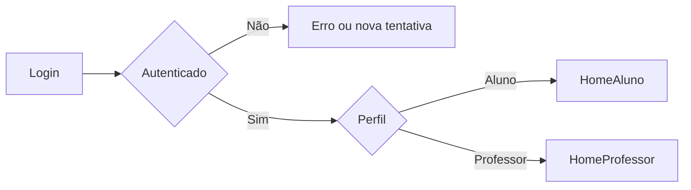

# User Flows

## Objetivo

Descrever as jornadas mínimas dos fluxos vistos no diagrama, com foco em
entrada, navegação e valor principal de cada view.

## Fluxo Macro

## Jornada: Login

### Entrada

- Usuario acessa app web ou mobile
- Encontra tela unica de autenticacao

### Passos minimos

1. Informar credenciais
2. Validar autenticacao
3. Identificar papel do usuario
4. Redirecionar para area correta

### Estados minimos

- carregando
- sucesso
- credencial invalida
- sessao expirada
- usuario sem permissao

## Jornada do Aluno

### Home do Aluno

Objetivo:
Dar visibilidade imediata da rotina do estudante.

Conteúdo esperado:

- próximas tarefas
- destaques de conteúdos
- agenda do dia ou da semana
- atalhos para jogos e comunidade

Saídas:

- acessar tarefas
- abrir conteúdos
- abrir calendário
- ir para jogos
- ir para comunidade
- abrir perfil

### Tarefas do Aluno

Objetivo:
Permitir ao aluno acompanhar o que precisa fazer.

Passos mínimos:

1. Ver lista de tarefas
2. Entrar no detalhe de um item
3. Entender prazo, status e orientações
4. Responder questões ou anexar arquivo
5. Confirmar envio
6. Acompanhar resultado depois da avaliação

Regras conhecidas:

- Tarefas com questões são compostas por questões
- Tarefas com anexo exigem upload de `PDF`, `Word` ou `TXT`
- O aluno só pode enviar uma vez
- Depois do envio não pode editar nem reenviar
- O aluno deve ver uma confirmação antes do envio final
- A view pode ser reaproveitada para consulta posterior de nota e retorno
- Questões podem ser:
  - dissertativas
  - multipla escolha com até `5` opções
- Questões podem conter imagem
- A explicação de resposta não fica visível durante a realização

Estados desejados:

- pendente
- em andamento
- entregue
- corrigido
- expirado

### Conteúdos do Aluno

Objetivo:
Permitir descoberta e consumo de materiais.

Passos mínimos:

1. Ver lista de conteúdos
2. Filtrar ou navegar por categoria
3. Abrir detalhe
4. Consumir material

Informações mínimas da view:

- titulo
- subtitulo
- descrição
- autor
- data de postagem
- imagem ou video quando houver

### Calendário do Aluno

Objetivo:
Organizar a rotina e antecipar prazos.

Passos mínimos:

1. Visualizar eventos e prazos
2. Abrir detalhes do evento
3. Navegar entre periodos
4. Criar anotacoes pessoais individuais

Eventos base esperados:

- entregas de tarefas
- anotações do próprio aluno

### Jogos do Aluno

Objetivo:
Estimular aprendizagem e engajamento.

Passos mínimos:

1. Ver catálogo ou área de jogos
2. Escolher experiencia
3. Iniciar interacao
4. Ver retorno de progresso ou pontuacao, se existir

Escopo base:

- entre `4` e `5` jogos
- possibilidade de uso de biblioteca externa ou API externa

### Comunidade do Aluno

Objetivo:
Criar espaco de interacao entre alunos.

Passos minimos:

1. Ver feed, mural ou topicos
2. Criar post com texto, imagem, video ou gif
3. Acompanhar status de moderacao
4. Interagir em posts aprovados

Regra central:

- post de aluno so fica visivel para outros alunos apos aprovacao de professor

### Perfil do Aluno

Objetivo:
Gerenciar informacoes pessoais e preferencias.

Passos minimos:

1. Visualizar dados do perfil
2. Editar informacoes permitidas
3. Ajustar preferencias
4. Atualizar foto de perfil

## Jornada do Professor

### Home do Professor

Objetivo:
Ser a central operacional do trabalho diario.

Conteúdo esperado:

- tarefas recentes
- tarefas com anexo pendentes de avaliação
- conteúdos criados ou pendentes
- eventos do calendário
- atalhos para comunidade e perfil

Saídas:

- criar ou abrir tarefas
- abrir conteúdos
- abrir calendário
- abrir comunidade
- abrir perfil

### Tarefas do Professor

Objetivo:
Permitir criar e acompanhar tarefas.

Passos mínimos:

1. Ver lista de tarefas
2. Escolher o comportamento da tarefa
3. Configurar informações principais
4. Montar questões ou descrição da tarefa com anexo
5. Validar pontuação
6. Publicar
7. Acompanhar entregas e status
8. Corrigir e registrar nota

Regras conhecidas:

- tarefas com questões possuem até `100` questões
- a pontuação máxima do item é `100`
- a soma dos valores das questões deve resultar em `100`
- questões podem ser dissertativas ou multipla escolha com até `5` opções
- questões podem ter imagem
- questões podem ter explicação esperada ou gabarito não visível ao aluno
- tarefa com anexo exige comentário obrigatório ao validar a nota do aluno

### Conteúdos do Professor

Objetivo:
Publicar e manter materiais de apoio.

Passos mínimos:

1. Ver lista de conteúdos
2. Criar novo conteúdo
3. Editar ou organizar
4. Publicar, editar ou excluir

Campos mínimos do conteúdo:

- titulo obrigatorio
- subtitulo obrigatorio
- descrição obrigatória
- data de postagem obrigatoria
- autor obrigatorio
- imagem opcional
- video opcional

### Calendário do Professor

Objetivo:
Acompanhar compromissos e datas acadêmicas.

Passos mínimos:

1. Visualizar agenda
2. Entrar em evento
3. Criar ou atualizar evento, se permitido

Integracoes esperadas:

- refletir datas de entrega de tarefas

### Comunidade do Professor

Objetivo:
Promover troca profissional e apoio entre professores.

Passos minimos:

1. Ver feed ou topicos
2. Criar publicacao
3. Aprovar posts de alunos
4. Responder interacoes

Regras conhecidas:

- posts de professores sao visiveis apenas para professores
- professores veem posts dos alunos para moderacao

### Perfil do Professor

Objetivo:
Gerenciar identidade e configuracoes pessoais.

Passos minimos:

1. Ver dados do perfil
2. Editar informacoes
3. Ajustar preferencias
4. Atualizar foto de perfil

## Estados Vazios Que Devem Ser Pensados Depois

- aluno sem atividades
- aluno sem notas publicadas
- professor sem conteúdos publicados
- calendário sem eventos
- comunidade sem publicacoes
- post de aluno aguardando aprovacao
- perfil incompleto
